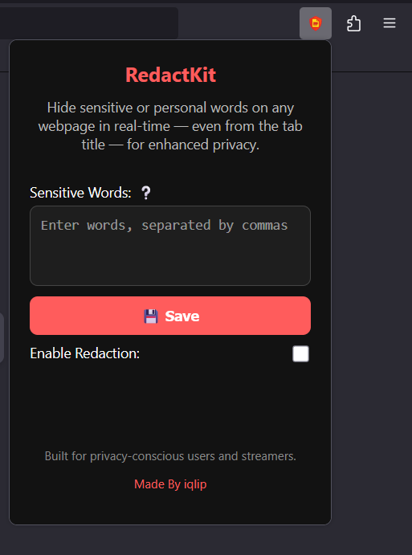
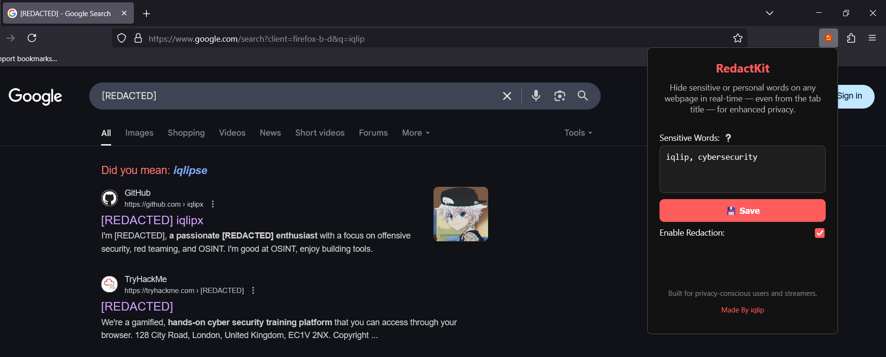
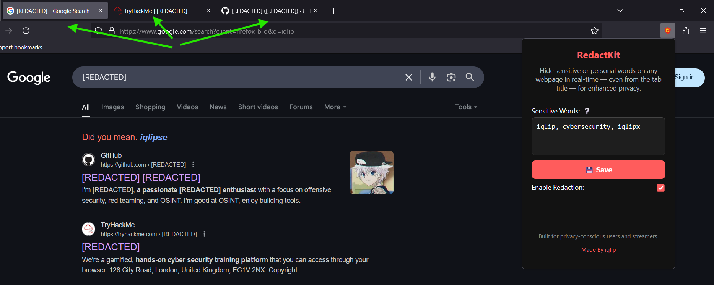

  

⚠️ **Note:** 
The RedactKit extension is currently on the awaiting list for review by Mozilla. I am waiting for approval, so please hang tight! Once it's live, you’ll be able to enjoy it on Firefox. Thank you for your patience!

# RedactKit — Redact It All, Protect It All

**RedactKit** is a Firefox extension that helps you protect your privacy by automatically hiding sensitive or personal words on any webpage. Whether it’s your **name, email, or anything else**, RedactKit replaces those words with `[REDACTED]` in real-time, even in form fields and the browser tab title.

Perfect for **streamers** 🎮, **screen-sharers** 💻, or anyone tired of manually blurring out their personal info 🔒.

## What It Brings to the Table

- Instant redaction of chosen words on any website
- Covers everything — page text, input fields, tab titles, and more
- Keeps up with live page changes — no refresh needed
- Fully customizable word list
- Clean, simple popup interface with save + toggle buttons
- 100% local – doesn’t ping a single external server

## Real-Life Uses

- Going live? 🎥 Keep names, emails, or passwords off your stream 🚫
- Sharing your screen at work? 💼 Hide sensitive client or internal terms 📄

## Getting Started

1. Tap the **RedactKit icon** in your Firefox toolbar  
2. Drop in the words you want to block (comma-separated)  
   _Example: `email, John, confidential`_
3. Hit **💾 Save**
4. Flip the switch to turn redaction on
5. That’s it — surf as usual. We’ll handle the hiding.

## Screenshots

### First Look – Extension Overview  
Here’s what the extension looks like when you first open it:

### Redaction in Action  
Watch how your selected words are replaced instantly across the webpage:

### Tab Title Redacted  
Even the browser tab title gets scrubbed for extra privacy:

## Privacy That Respects Yours

- No logs. No trackers. No cloud.  
- Everything runs locally, right in your browser  
- It’s privacy-enhancing — not privacy-invasive

## 💬 Pro Tip

Need to tweak your list? Just open the extension, update your keywords, and save — changes go live instantly.

## Crafted By

Made with privacy in mind by [iqlip](https://github.com/iqlipx).
Because your screen should only show what you choose to share.
